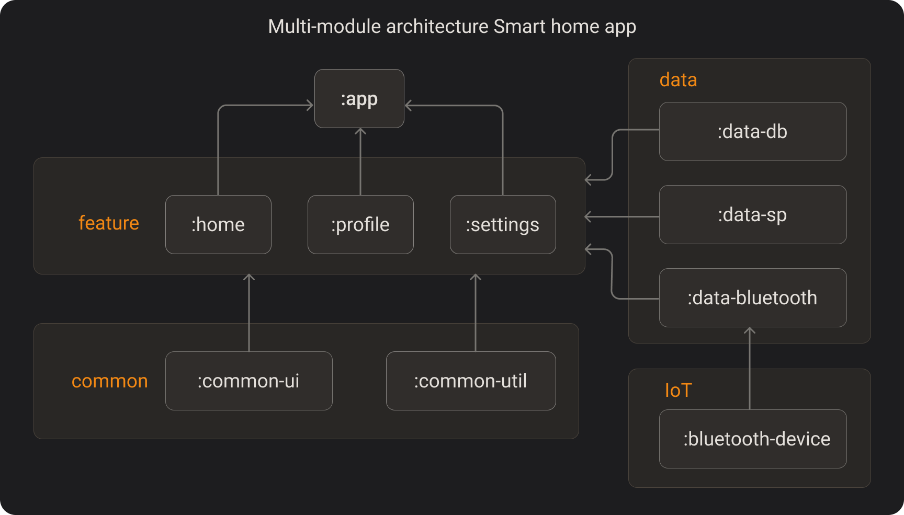
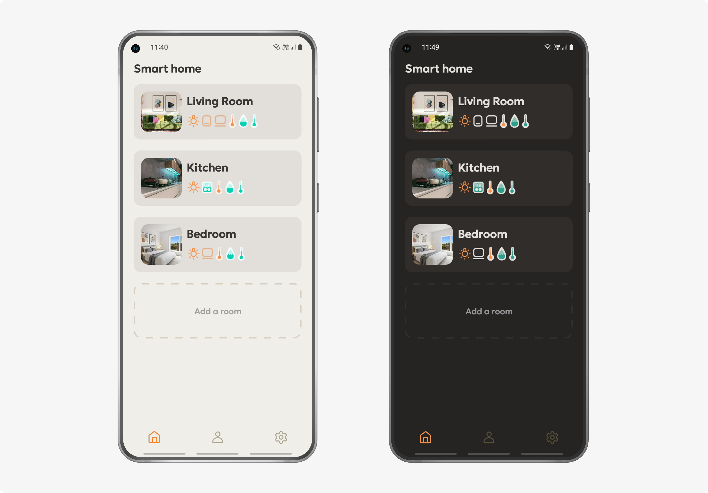
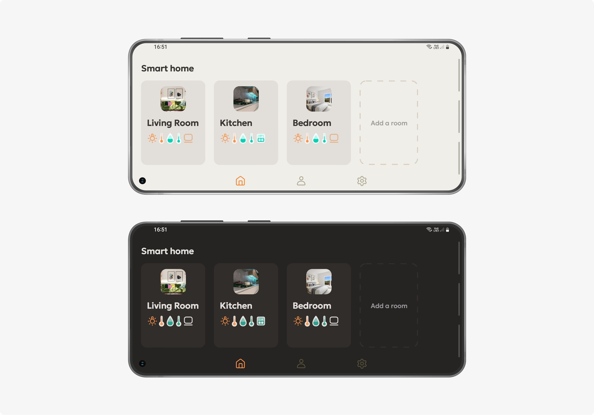
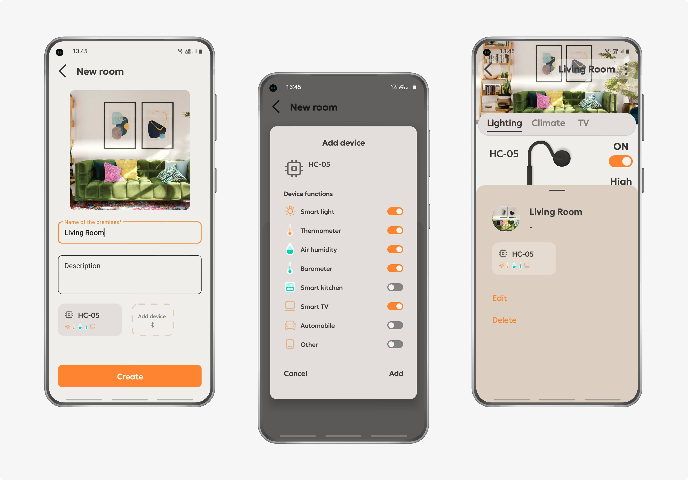
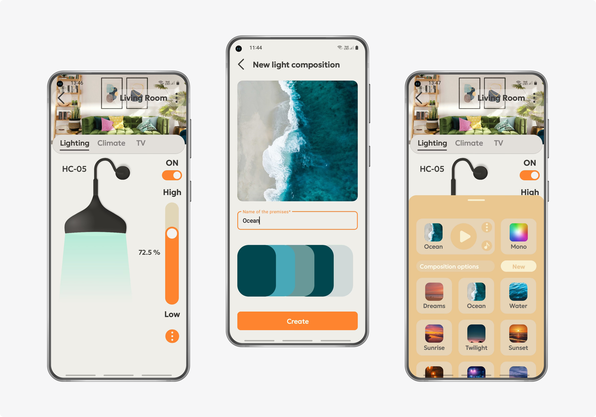
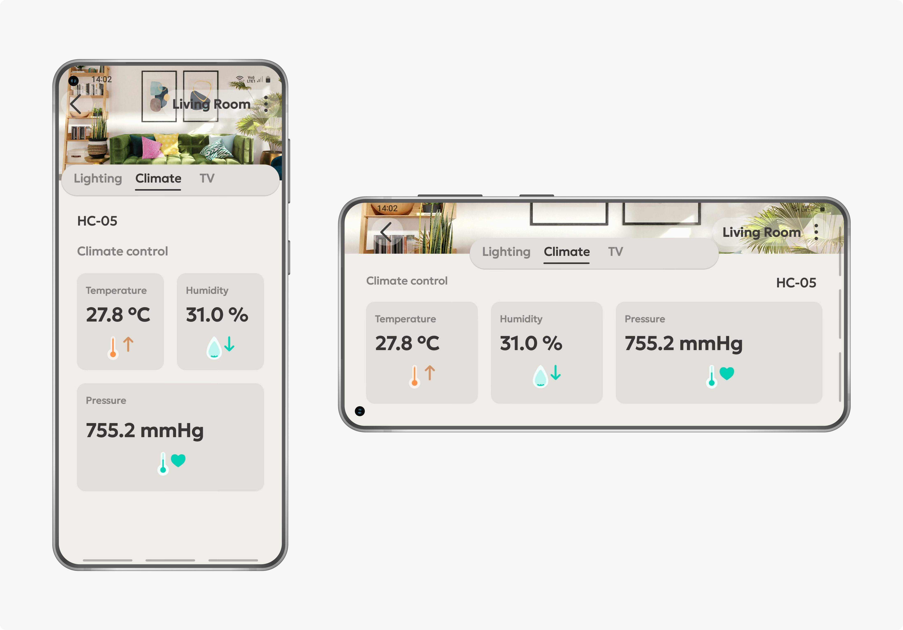
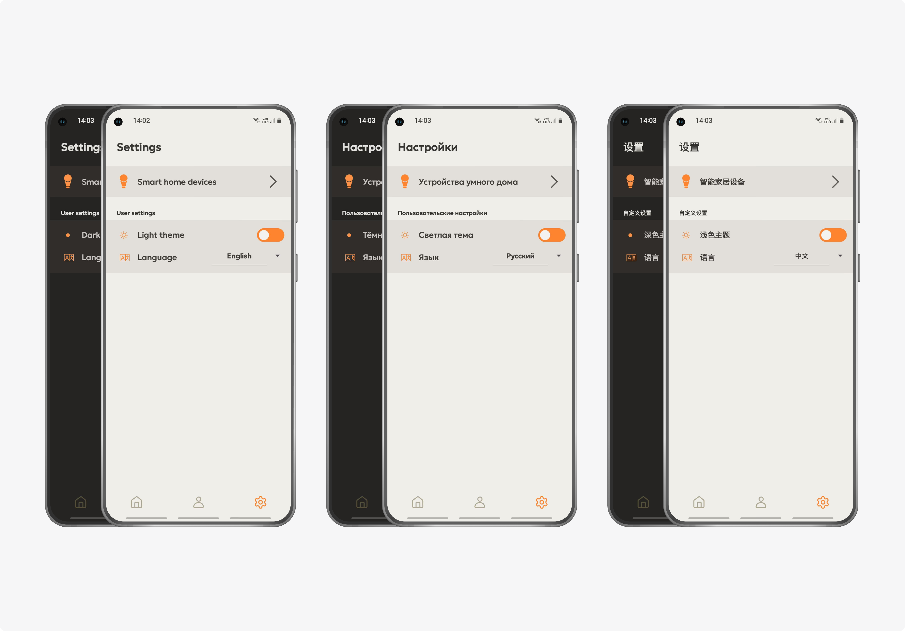
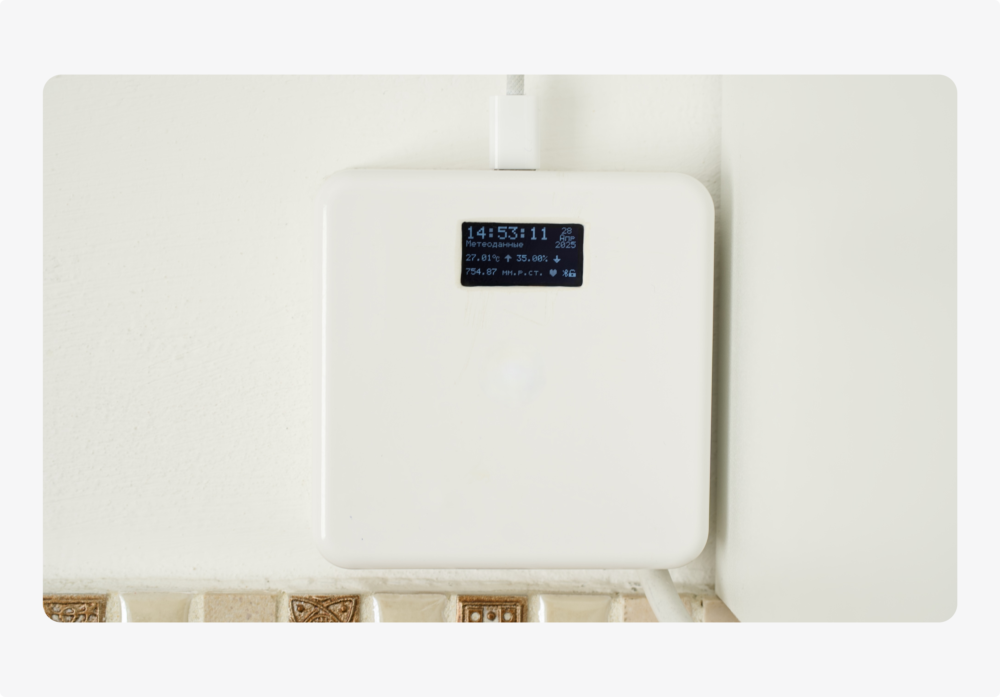
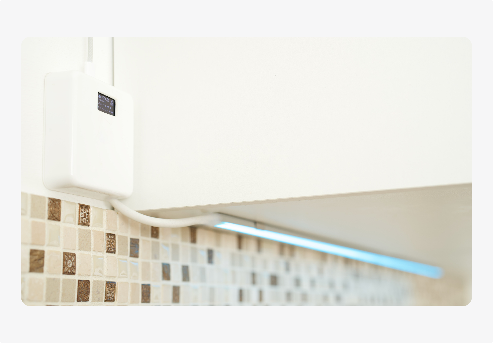

[English](README.en.md) | [Русский](README.md)
# SmartHomeApp
## Android App for Smart Home Control via Bluetooth
SmartHomeApp is an Android application for managing climate and lighting in a smart home system. The project includes:
* Development of a Android app with modern architectural patterns,
* A custom Bluetooth library,
* Implementation of an IoT device based on Atmega328p with firmware in C/C++,
* A custom JSON-based messaging protocol.

## Key Features
* Real-time control of IoT device via Bluetooth
* Clean Architecture, MVVM
* Custom Bluetooth library: socket, thread, JSON handling
* Smart lighting based on image analysis (Palette API)
* Sensor data handling: temperature, humidity, pressure
* Reactive and bidirectional communication (Coroutines + SharedFlow)

## App Architecture
* Single Activity + Jetpack Navigation Component
* Multi-module structure
* MVVM + Clean Architecture (Presentation / Domain / Data)
* Dependency Injection with Koin
* Asynchronous programming with Kotlin Coroutines and Flow
* SharedFlow for reactive UI updates

<p align="left">

</p>

## Technologies and Tools
Languages:
* Kotlin - Android app
* C/C++ - Atmega328p firmware  
  Technologies:
* Room / SharedPreferences - local storage
* Bluetooth SPP (Serial Port Profile) - communication
* Sockets & Streams - data transfer
* Palette API - image analysis
* FlexboxLayout, ViewPager2 (custom), Glide - UI
* Gradle + Proguard - build and optimization

## Custom Bluetooth Library
The modular Bluetooth library developed in this project includes:
* Connection and socket management
* Streamed data transmission
* Reactive message delivery to UI via Coroutines and Flow
* JSON protocol handling for bidirectional communication

## IoT Device on Atmega328p
Device features:
* Reading sensor data: temperature, humidity, pressure
* RGB backlight with multiple modes:
  - Monochrome
  - Palette-based color composition from image
  - Brightness adjustment
* Acoustic feedback
* LED display
* Automatic receiver shutdown on idle

Device sketch:
[sketch_smart_home_en.ino](https://github.com/MSagGik/SmartHomeApp/blob/main/sketch_arduino/sketch_smart_home_en.ino)

## Communication Protocol (JSON)
### Incoming message example
``` JSON
{
    "type": "SMART_HOME_DATA",
    "temperature": "A",
    "humidity": "B",
    "pressure": "C",
    "led_m": "D",
    "led_a": "E",
    "led_r": "F",
    "led_g": "G",
    "led_b": "I"
}
```
### Outgoing message examples:
**Brightness adjustment**
``` JSON
{ "type": "LED_ALPHA", "a": "N" }
```
**Monochrome mode**
``` JSON
{
    "type": "LED_MONO",
    "m": "A",
    "a": "B",
    "r": "C",
    "g": "D",
    "b": "E"
}
```
**Color composition (5 key colors)**
``` JSON
{ "type": "LED_FLOW_A", "a": "A", "r0": "B", "g0": "C", "b0": "D", "r1": "E" }
{ "type": "LED_FLOW_B", "g1": "F", "b1": "G", "r2": "H", "g2": "J", "b2": "K" }
{ "type": "LED_FLOW_C", "r3": "L", "g3": "M", "b3": "N", "r4": "O", "g4": "P" }
{ "type": "LED_FLOW_FIN", "g4": "Q", "m": "R" }
```
Sent in series to avoid microcontroller buffer overload.
**Time calibration**
``` JSON
{ "type": "TIME_UPDATE", "epoch": "N" }
```
**Receiver control**
``` JSON
{ "type": "COM_ENABLED", "state_com": "N" }
```
## Intuitive UX/UI
* Modern app design with animations and adaptive layouts
* Simple and clear mode control
* Support for dark and light themes, three languages (English, Russian, Chinese), and both portrait and landscape smartphone orientations
* Microcontroller interface with LED indication and sound

### App screenshots:
<p align="left">

</p>
<p align="left">

</p>
<p align="left">

</p>
<p align="left">

</p>
<p align="left">

</p>
<p align="left">

</p>
<p align="left">

</p>
<p align="left">

</p>

## Content Used
- Geologica font [source and license](https://fonts.google.com/specimen/Geologica/license) (https://fonts.google.com/specimen/Geologica/license) (accessed April 28, 2025)
- Illustrations [source and license Unsplash](https://unsplash.com/license) (accessed April 28, 2025), authors:
  * Spacejoy [photo](https://unsplash.com/photos/green-and-white-throw-pillows-on-green-sofa-ml2RSaDME-k) (https://unsplash.com/photos/green-and-white-throw-pillows-on-green-sofa-ml2RSaDME-k)
  * roam in color [photo](https://unsplash.com/photos/electric-stove-with-cooking-pots-4VKQgWgn0Xo) (https://unsplash.com/photos/electric-stove-with-cooking-pots-4VKQgWgn0Xo)
  * Point3D Commercial Imaging Ltd. [photo](https://unsplash.com/photos/white-bed-linen-with-2-white-pillows-xON7AlJZemw) (https://unsplash.com/photos/white-bed-linen-with-2-white-pillows-xON7AlJZemw)
  * Shifaaz shamoon [photo](https://unsplash.com/photos/aerial-photo-of-seashore-sLAk1guBG90) (https://unsplash.com/photos/aerial-photo-of-seashore-sLAk1guBG90)
  * Ryan Loughlin [photo](https://unsplash.com/photos/a-flock-of-birds-standing-on-top-of-a-sandy-beach-p3ocWhESo50) (https://unsplash.com/photos/a-flock-of-birds-standing-on-top-of-a-sandy-beach-p3ocWhESo50)
  * Kartabya Aryal [photo](https://unsplash.com/photos/blue-body-of-water-during-daytime-iM1XCCd1LqY) (https://unsplash.com/photos/blue-body-of-water-during-daytime-iM1XCCd1LqY)
  * Clint Patterson [photo](https://unsplash.com/photos/sunrise-VdfeYvJSKs0) (https://unsplash.com/photos/sunrise-VdfeYvJSKs0)
  * Paul Pastourmatzis [photo](https://unsplash.com/photos/silhouette-of-trees-near-body-of-water-painting-xAMZ67ZWIgY) (https://unsplash.com/photos/silhouette-of-trees-near-body-of-water-painting-xAMZ67ZWIgY)
  * Nastia Petruk [photo](https://unsplash.com/photos/the-sun-is-setting-over-the-water-on-the-beach-tO4WQR5hlcc) (https://unsplash.com/photos/the-sun-is-setting-over-the-water-on-the-beach-tO4WQR5hlcc)
  * Franco Gancis [photo](https://unsplash.com/photos/a-number-of-lights-hanging-from-a-ceiling-j5vIonkG-UI) (https://unsplash.com/photos/a-number-of-lights-hanging-from-a-ceiling-j5vIonkG-UI)
  * Oleksii Holovachko [photo](https://unsplash.com/fr/photos/une-rue-de-la-ville-la-nuit-avec-des-voitures-garees-sur-le-bord-de-la-route-UNeOqldSFmo) (https://unsplash.com/fr/photos/une-rue-de-la-ville-la-nuit-avec-des-voitures-garees-sur-le-bord-de-la-route-UNeOqldSFmo)
  * Daniil Silantev [photo](https://unsplash.com/photos/a-large-storm-moving-across-a-large-body-of-water-dzBo4NIQdIw) (https://unsplash.com/photos/a-large-storm-moving-across-a-large-body-of-water-dzBo4NIQdIw)