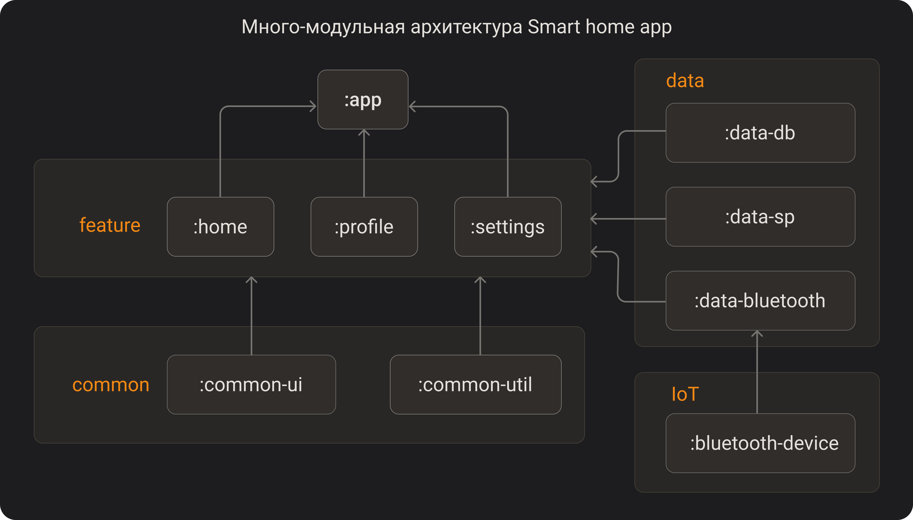
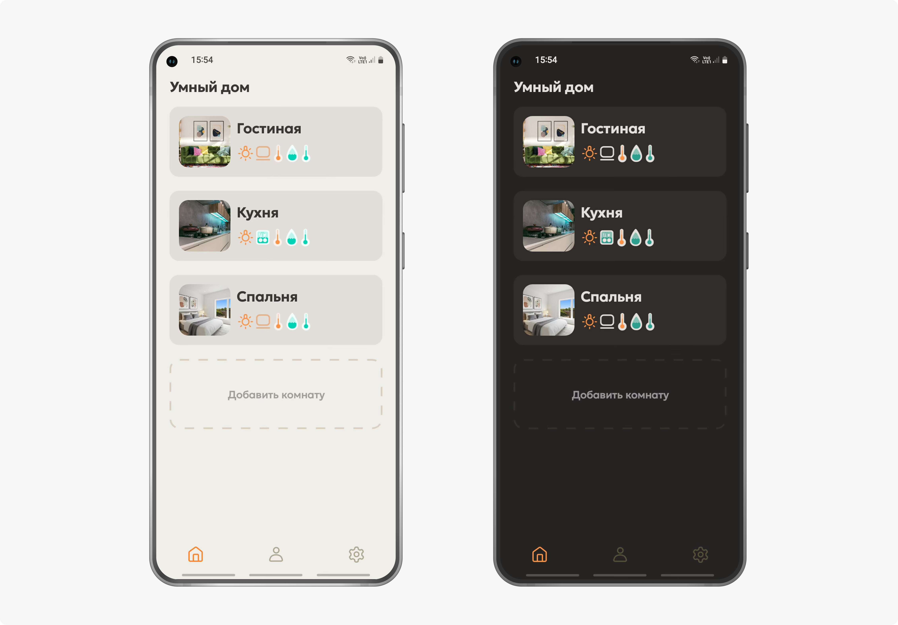
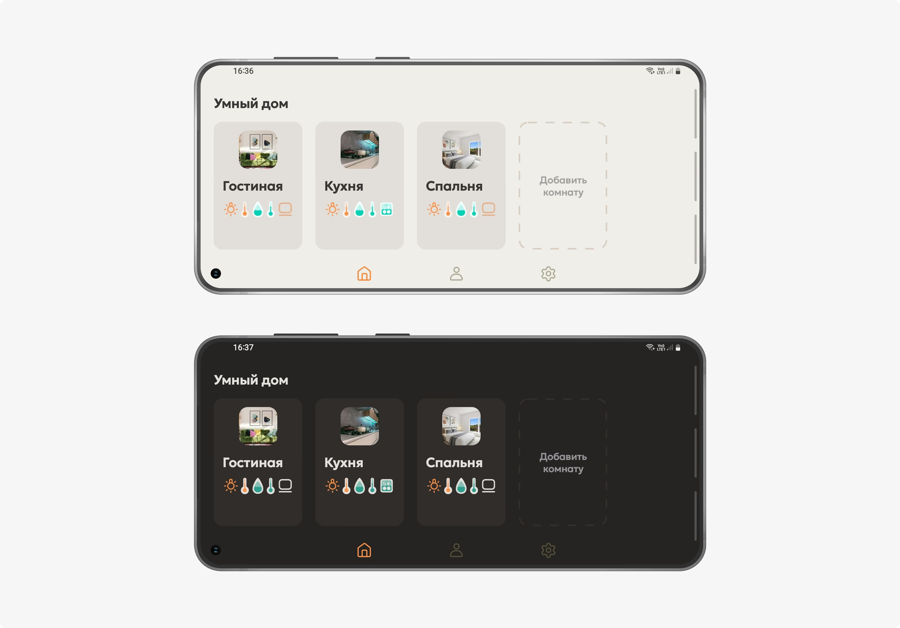
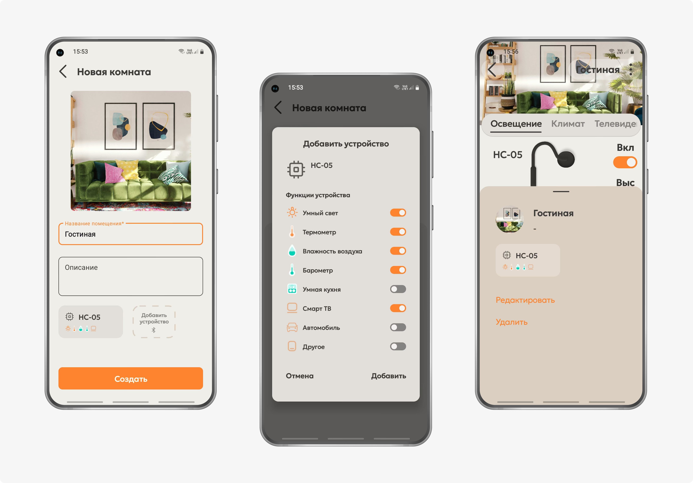
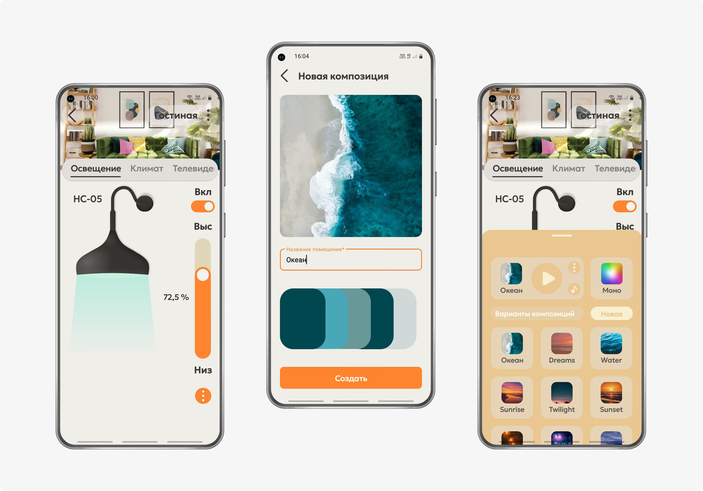
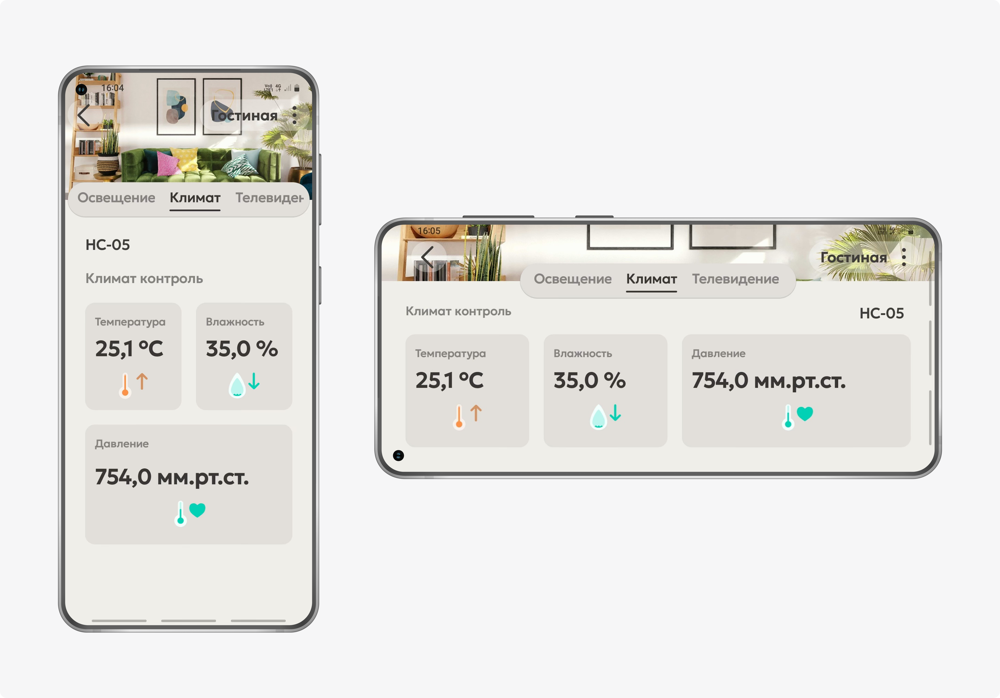

[Русский](README.md) | [English](README.en.md)
# SmartHomeApp
## Android-приложение для управления умным домом через Bluetooth
SmartHomeApp — это Android-приложение для управления климатом и освещением в системе умного дома. Проект включает:
* разработку Android-приложения с современными архитектурными подходами,
* собственную Bluetooth-библиотеку,
* реализацию IoT-устройства на базе Atmega328p с прошивкой на C/C++,
* кастомный протокол обмена сообщениями (JSON).

## Ключевые особенности
* Управление IoT-устройством в реальном времени через Bluetooth
* Чистая архитектура: Clean Architecture + MVVM
* Своя Bluetooth-библиотека: работа с сокетами, потоками, JSON
* Умное освещение на основе анализа изображений (Palette API)
* Работа с сенсорами: температура, влажность, давление
* Реактивное и двунаправленное взаимодействие (Coroutines + SharedFlow)

## Архитектура приложения
* Single Activity + Jetpack Navigation Component
* Многомодульная структура
* MVVM + Clean Architecture (Presentation / Domain / Data)
* Dependency Injection с Koin
* Асинхронность через Kotlin Coroutines и Flow
* SharedFlow для реактивного обновления UI

<p align="left">

</p>

## Технологии и инструменты
Языки:
* Kotlin — Android-приложение
* C/C++ — прошивка Atmega328p
Технологии:
* Room / SharedPreferences — локальное хранение
* Bluetooth SPP (Serial Port Profile) — коммуникация
* Sockets & Streams — передача данных
* Palette API — анализ изображений
* FlexboxLayout, ViewPager2 (кастом), Glide — UI
* Gradle + Proguard — сборка, оптимизация

## Собственная Bluetooth-библиотека
Модульная Bluetooth-библиотека, разработанная в рамках проекта, включает:
* Управление соединением и сокетами
* Потоковую передачу данных
* Реактивную доставку сообщений в UI через Coroutines и Flow
* Работа с JSON-протоколом для двунаправленного взаимодействия

## IoT-устройство на Atmega328p
Функции устройства:
* Чтение данных с сенсоров: температура, влажность, давление
* RGB-подсветка с поддержкой нескольких режимов:
  - Моноцвет
  - Композиция из палитры изображения
  - Регулировка яркости
* Акустическая обратная связь
* LED-дисплей
* Автоматическое отключение ресивера при простое

Скетч устройства:
[sketch_smart_home_ru.ino](https://github.com/MSagGik/SmartHomeApp/blob/main/sketch_arduino/sketch_smart_home_ru.ino)

## Протокол взаимодействия (JSON)
### Пример входящего сообщения
``` JSON
{
    "type": "SMART_HOME_DATA",
    "temperature": "A",
    "humidity": "B",
    "pressure": "C",
    "led_m": "D",
    "led_a": "E",
    "led_r": "F",
    "led_g": "G",
    "led_b": "I"
}
```
### Примеры исходящих сообщений:
**Регулировка яркости**
``` JSON
{ "type": "LED_ALPHA", "a": "N" }
```
**Моноцвет**
``` JSON
{
    "type": "LED_MONO",
    "m": "A",
    "a": "B",
    "r": "C",
    "g": "D",
    "b": "E"
}
```
**Цветовая композиция (5 ключевых цветов)**
``` JSON
{ "type": "LED_FLOW_A", "a": "A", "r0": "B", "g0": "C", "b0": "D", "r1": "E" }
{ "type": "LED_FLOW_B", "g1": "F", "b1": "G", "r2": "H", "g2": "J", "b2": "K" }
{ "type": "LED_FLOW_C", "r3": "L", "g3": "M", "b3": "N", "r4": "O", "g4": "P" }
{ "type": "LED_FLOW_FIN", "g4": "Q", "m": "R" }
```
Отправляется серией, чтобы не перегружать буфер микроконтроллера.
**Калибровка времени**
``` JSON
{ "type": "TIME_UPDATE", "epoch": "N" }
```
**Управление ресивером**
``` JSON
{ "type": "COM_ENABLED", "state_com": "N" }
```
## Интуитивный UX/UI
* Современный дизайн приложения с анимациями и адаптивной версткой
* Простое и наглядное управление режимами
* Поддержка тёмной и светлой тем, трёх языков (английский, русский и китайский) и вертикального и горизонтального режимов экрана смартфона
* Интерфейс на микроконтроллере с LED-индикацией и звуком

* Скриншоты приложения:
<p align="left">

</p>
<p align="left">

</p>
<p align="left">

</p>
<p align="left">

</p>
<p align="left">

</p>
<p align="left">

</p>
<p align="left">

</p>
<p align="left">

</p>

## Используемый контент:
- шрифт Geologica [источник и лицензия](https://fonts.google.com/specimen/Geologica/license) (https://fonts.google.com/specimen/Geologica/license) (дата обращения 28 апреля 2025 года)
- иллюстрации [источник и лицензия Unsplash](https://unsplash.com/license) (дата обращения 28 апреля 2025 года), авторы:
  * Spacejoy [фото](https://unsplash.com/photos/green-and-white-throw-pillows-on-green-sofa-ml2RSaDME-k) (https://unsplash.com/photos/green-and-white-throw-pillows-on-green-sofa-ml2RSaDME-k)
  * roam in color [фото](https://unsplash.com/photos/electric-stove-with-cooking-pots-4VKQgWgn0Xo) (https://unsplash.com/photos/electric-stove-with-cooking-pots-4VKQgWgn0Xo)
  * Point3D Commercial Imaging Ltd. [фото](https://unsplash.com/photos/white-bed-linen-with-2-white-pillows-xON7AlJZemw) (https://unsplash.com/photos/white-bed-linen-with-2-white-pillows-xON7AlJZemw)
  * Shifaaz shamoon [фото](https://unsplash.com/photos/aerial-photo-of-seashore-sLAk1guBG90) (https://unsplash.com/photos/aerial-photo-of-seashore-sLAk1guBG90)
  * Ryan Loughlin [фото](https://unsplash.com/photos/a-flock-of-birds-standing-on-top-of-a-sandy-beach-p3ocWhESo50) (https://unsplash.com/photos/a-flock-of-birds-standing-on-top-of-a-sandy-beach-p3ocWhESo50)
  * Kartabya Aryal [фото](https://unsplash.com/photos/blue-body-of-water-during-daytime-iM1XCCd1LqY) (https://unsplash.com/photos/blue-body-of-water-during-daytime-iM1XCCd1LqY)
  * Clint Patterson [фото](https://unsplash.com/photos/sunrise-VdfeYvJSKs0) (https://unsplash.com/photos/sunrise-VdfeYvJSKs0)
  * Paul Pastourmatzis [фото](https://unsplash.com/photos/silhouette-of-trees-near-body-of-water-painting-xAMZ67ZWIgY) (https://unsplash.com/photos/silhouette-of-trees-near-body-of-water-painting-xAMZ67ZWIgY)
  * Nastia Petruk [фото](https://unsplash.com/photos/the-sun-is-setting-over-the-water-on-the-beach-tO4WQR5hlcc) (https://unsplash.com/photos/the-sun-is-setting-over-the-water-on-the-beach-tO4WQR5hlcc)
  * Franco Gancis [фото](https://unsplash.com/photos/a-number-of-lights-hanging-from-a-ceiling-j5vIonkG-UI) (https://unsplash.com/photos/a-number-of-lights-hanging-from-a-ceiling-j5vIonkG-UI)
  * Oleksii Holovachko [фото](https://unsplash.com/fr/photos/une-rue-de-la-ville-la-nuit-avec-des-voitures-garees-sur-le-bord-de-la-route-UNeOqldSFmo) (https://unsplash.com/fr/photos/une-rue-de-la-ville-la-nuit-avec-des-voitures-garees-sur-le-bord-de-la-route-UNeOqldSFmo)
  * Daniil Silantev [фото](https://unsplash.com/photos/a-large-storm-moving-across-a-large-body-of-water-dzBo4NIQdIw) (https://unsplash.com/photos/a-large-storm-moving-across-a-large-body-of-water-dzBo4NIQdIw)