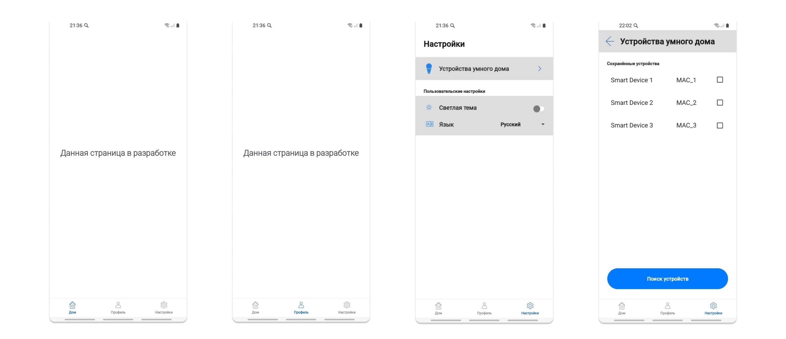

# SmartHomeApp
## Приложение для управления IoT устройствами умного дома через Bluetooth (пример климат-контроля и освещения на базе контроллера Arduino Nano)
## Стек применяемых технологий:
1. Языки Kotlin, С, С++
2. Многомодульная архитектура и паттерн MVVM
3. Библиотеки Koin, LiveData, Retrofit
4. Контроллер Arduino
5. Bluetooth
## Описание приложения:
* Для экономии вычислительных ресурсов используется принцип одной активности и множества фрагментов
* Навигация между фрагментами осуществляется с помощью NavController
* Для обеспечения стабильной работы BottomNavigationView используются вложенные навигационные граффы
* Многомодульность реализуется по следующей схеме:

* Скриншоты приложения:

Мобильное приложение разработано в учебных/образовательных целях